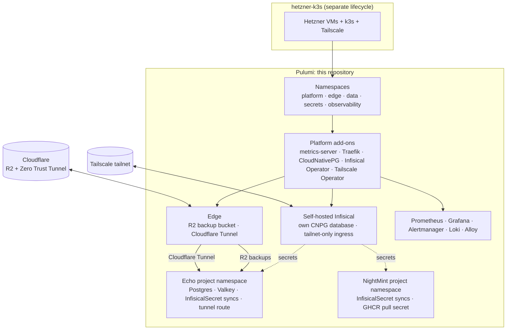

# Architecture

Sanitized diagram of what `index.ts` actually provisions. No real hostnames, account IDs, or secrets appear here — see `README.md` for the real config keys and `Pulumi.example.yaml` for a non-secret reference.

## System overview

## Module responsibilities

- `index.ts`: composition root. Wires namespaces → platform → edge → Infisical → per-project modules → observability, in that order.
- `src/namespaces.ts`: creates the five baseline namespaces (`platform`, `edge`, `data`, `secrets`, `observability`) shared by every project.
- `src/platform.ts`: installs cluster-wide Helm releases — metrics-server, Traefik (private ingress), CloudNativePG operator, Infisical Secrets Operator, and conditionally the Tailscale Kubernetes Operator.
- `src/edge.ts`: provisions the Cloudflare R2 backup bucket, per-namespace backup credentials, and (when `cloudflaredEnabled`) the Cloudflare Zero Trust Tunnel plus its in-cluster `cloudflared` deployment. `configureTunnelRoutes` attaches each project's public hostname to the shared tunnel.
- `src/infisical.ts`: deploys self-hosted Infisical with its own CloudNativePG-managed Postgres, SMTP config, and a tailnet-only Ingress — the only ingress Infisical exposes.
- `src/observability.ts`: installs Prometheus, Grafana, Alertmanager, and Loki, plus a Grafana Alloy config (embedded here as a checksummed string) that ships pod logs into Loki.
- `src/projects/echo/*`: Echo's dedicated namespace, CloudNativePG Postgres cluster + scheduled R2 backup, Valkey (BullMQ), `InfisicalSecret` syncs for `/shared`, `/api`, `/worker`, and the Cloudflare Tunnel route for `echo-api`.
- `src/projects/nightmint.ts`: NightMint's namespace, its own Infisical project/environment wiring, and a shared GHCR pull secret via `src/ghcr.ts`.
- `src/projects/node-selector.ts`: parses `orbit:dataNodeSelector` (`label=value`) so every project can pin stateful workloads to the same chosen data-plane node.

## Deployment lifecycle boundary

`hetzner-k3s` (bootstrapped via `k3s/hetzner-k3s.sh`) owns VM provisioning, k3s installation, private networking, and Tailscale enrollment. This Pulumi program never shells out to it and never manages VMs directly — it only manages what runs *inside* the already-bootstrapped cluster. The two lifecycles are deployed and rolled back independently.

## Operational maturity

- **Single control plane, two schedulable workers.** Every stateful service (Postgres, Valkey, Infisical's own database) runs as a single instance on Hetzner volumes with external backup — this is not a highly-available data plane. A worker or volume-location failure requires manual recovery, not automatic failover.
- **Backup path.** CloudNativePG's native `barmanObjectStore` ships Postgres backups to R2. It is marked deprecated in favor of the Barman Cloud CNPG-I plugin; migrating before the native path is removed is tracked as a follow-up, and a restore test is the acceptance criterion for any backup change.
- **etcd.** k3s local etcd snapshots are not sufficient disaster recovery on their own; an external etcd snapshot upload to R2 belongs in the `hetzner-k3s` bootstrap layer, not here.
- **No automated validation today.** This repository has no test suite and, until this change, no CI workflow — `pnpm typecheck` was a manual step. See `.github/workflows/ci.yml` for the minimal check now run on every pull request.
